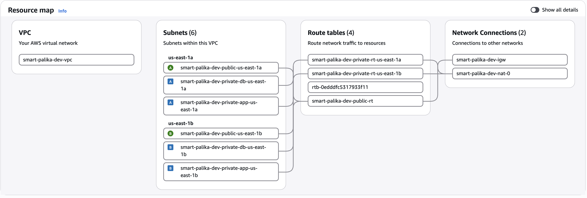
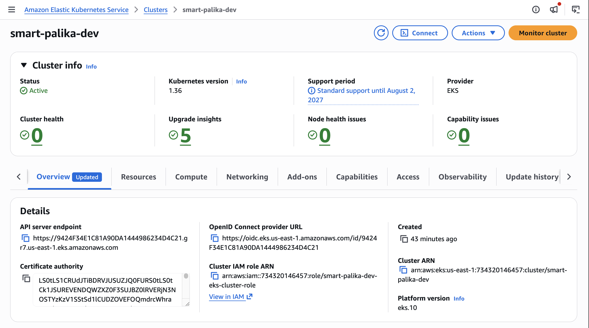
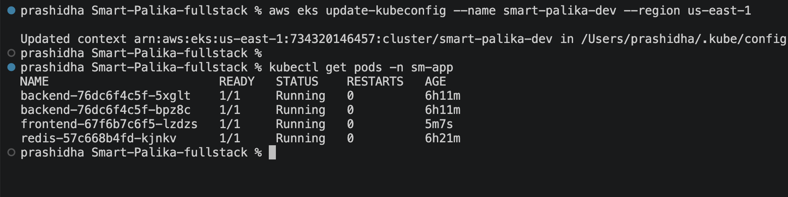
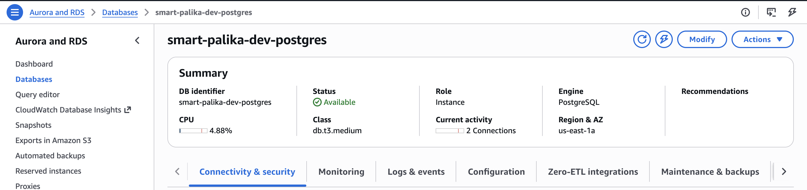
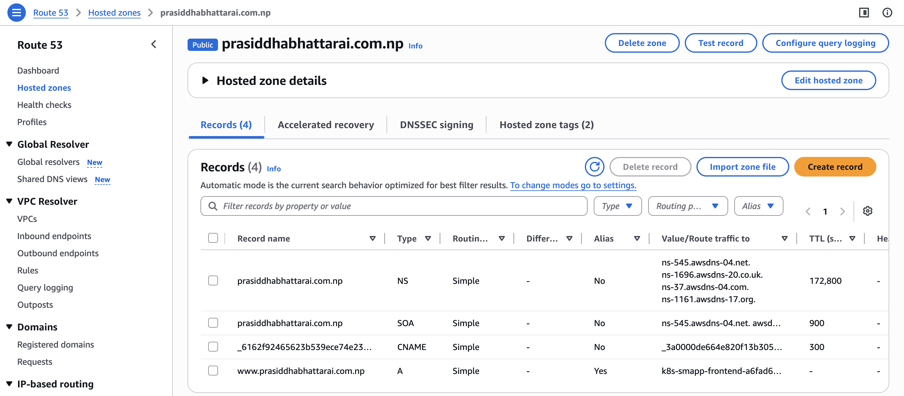
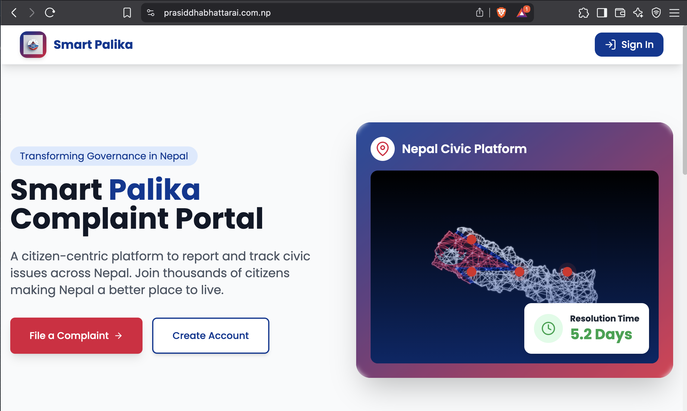
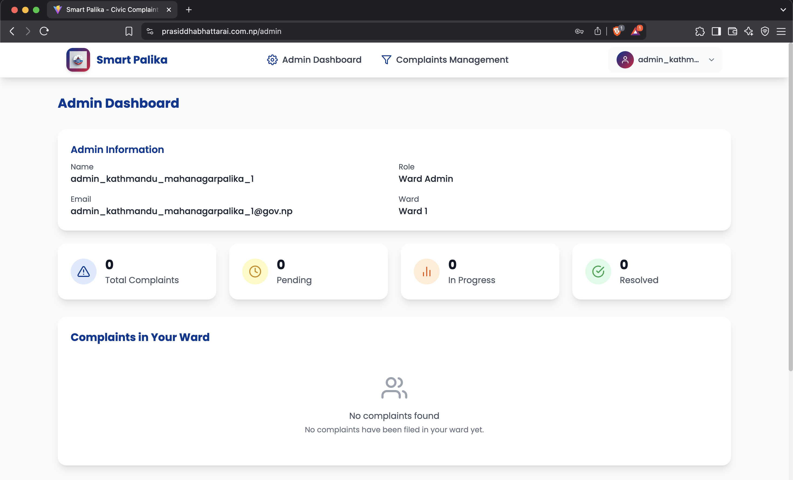
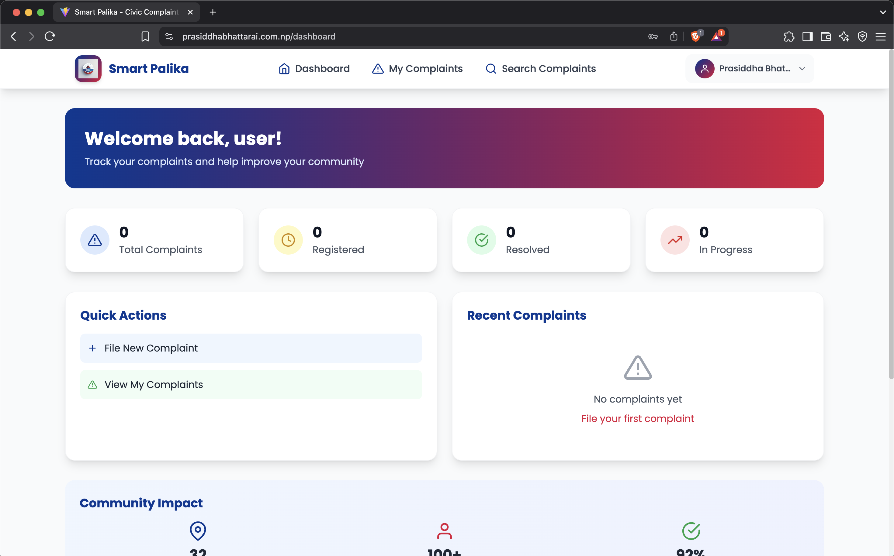

## Smart Palika

A comprehensive civic complaint management system deployed to AWS using GitHub Workflows with infrastructure created through Terraform.

Creates AWS Resources (VPC, EKS, RDS, Route53-record) and hosts the application in custom-domain.

---

## Documentation Link
[Google docs link](https://docs.google.com/document/d/1cKKc3LnZaUP8Pisw6VcN0AWG-stlp6cmijgwJSjO6zY/edit?usp=sharing)

---

## AWS architecture


---

## Project structure

```
├── README.md
├─.github/workflows.    # CI/CD
│   ├── publish_docker_hub.yaml
│   ├── tf_apply.yaml
│   └── tf_destroy.yaml
├── app                 # app source code
│   ├── README.md
│   ├── client
│   │   ├── Dockerfile
│   │   ├── README.md
│   │   ├── .gitignore
│   └── server
│   │   ├── Dockerfile
│   │   ├── README.md
│   │   ├── .gitignore
├── k8s                  # k8s manifest files
│   ├── README.md
│   ├── <yaml files>
└── terraform            # terraform codes
    ├── README.md
    ├── backend
    │   └── dev.tfbackend
    ├── environments
    │   └── dev
    └── modules
        ├── eks
        ├── eks-addons
        ├── elasticache
        ├── rds
        ├── route53
        └── vpc
```

| Directory                | Purpose                                                                                                                              |
| ------------------------ | ------------------------------------------------------------------------------------------------------------------------------------ |
| `.github/workflows`      | Contains GitHub Actions workflows for CI/CD, Docker publishing, and Terraform operations.                                            |
| `app`                    | Contains the application source code, including the frontend (`client`) and backend (`server`).                                      |
| `app/client`             | Contains the frontend application code and its Docker configuration.                                                                 |
| `app/server`             | Contains the backend application code and its Docker configuration.                                                                  |
| `k8s`                    | Contains Kubernetes manifest files for deploying and managing the application on Kubernetes.                                         |
| `terraform`              | Contains Terraform infrastructure-as-code for provisioning and managing AWS resources.                                               |
| `terraform/backend`      | Contains Terraform backend configuration for storing Terraform state.                                                                |
| `terraform/environments` | Contains environment-specific Terraform configurations, such as `dev`.                                                               |
| `terraform/modules`      | Contains reusable Terraform modules for AWS infrastructure components such as VPC, EKS, RDS, ElastiCache, Route 53, and EKS add-ons. |

---

## Implementation

### 1. Clone repo

```bash
git clone https://github.com/PrasiddhaBhattarai/smart-palika-Terraform-EKS.git
cd smart-palika-Terraform-EKS
```

### 2. Go to Terraform Environment you want to apply

```bash
cd terraform/environments/dev
or
cd terraform/environments/prod
```

### 3. Create `terraform.tfvars` from `terraform.tfvars.example`

### 4. Apply Terraform

```bash
terraform init -backend-config=../../backend/dev.tfbackend
or
terraform init -backend-config=../../backend/prod.tfbackend

terraform fmt -recursive
terraform validate
terraform plan --auto-approve -out=tfplan
terraform apply --auto-approve tfplan
```

---

## Issues faced

### 1. backend_deployment.yaml failed to run apply
```bash
│ Error: sm-app/backend failed to run apply: error when retrieving current configuration of:
│ Resource: "apps/v1, Resource=deployments", GroupVersionKind: "apps/v1, Kind=Deployment"
│ Name: "backend", Namespace: "sm-app"
│ from server for: "/tmp/2491101871kubectl_manifest.yaml": Unauthorized
│
│ with module.eks-addons.kubectl_manifest.app["backend-deployment.yaml"],
│ on ../../modules/eks-addons/k8s_apply.tf line 151, in resource "kubectl_manifest" "app":
│ 151: resource "kubectl_manifest" "app" {
│
╵
Error: Terraform exited with code 1.
```
### Solution
- Re-Apply the terraform and it will work
- `terraform apply --auto-approve`

<br>

### 2. Error acquiring state lock
- Some previous terraform apply failed and did close cleanly
- As a result didn't remove the object lock on remote state file stored in AWS S3
```bash
╷
│ Error: Error acquiring the state lock
│ 
│ Error message: operation error S3: PutObject, https response error
│ StatusCode: 412, RequestID: SYNCT0F8MM7A3NWD, HostID:
│ +nlak3zW0yZxB599/vVnqZyk0t2YnNGdiEjzHMDiAZHCwKHavxwabBaoZ2Fq4OjK4ipG484dViHxeT6x0JYkpus+subPg2zE,
│ api error PreconditionFailed: At least one of the pre-conditions you
│ specified did not hold
│ Lock Info:
│   ID:        831943a3-3fda-76ec-8f40-b75cbfdaeb4a
│   Path:      prasiddha-bucket-734320146457-us-east-1-an/smart-palika/dev/terraform.tfstate
│   Operation: OperationTypeApply
│   Who:       runner@runnervmejwal
│   Version:   1.15.0
│   Created:   2026-09-06 11:15:57.423560563 +0000 UTC
│   Info:      
│ 
│ 
│ Terraform acquires a state lock to protect the state from being written
│ by multiple users at the same time. Please resolve the issue above and try
│ again. For most commands, you can disable locking with the "-lock=false"
│ flag, but this is not recommended.
╵
Error: Terraform exited with code 1.
Error: Process completed with exit code 1.
``` 
### Solution
- Note the Lock Info ID from error message
- Go to the directory/configuration points to the same Terraform state/backend that is currently locked.
- Initialize terraform 
- Remove the lock
```bash
terraform init -backend-config=../../backend/dev.tfbackend

# terraform force-unlock <log info ID>
terraform force-unlock 831943a3-3fda-76ec-8f40-b75cbfdaeb4a
```
<br>

### 3. Unable to destroy k8s ingress ALB
- The internet-facing ALB created by `/k8s/ingress.yaml` wasn't tracked by terraform
- Hence `terraform destroy` was unable to destroy the ALB resources
- As a result, `terraform destroy` failed
### Solution
- Created `null_resource` with provisioner local-exec to run local scripts to explicitly delete ingress ALB and its resources
- `null_resource.ingress_cleanup` in `terraform/modules/eks-addons/k8s-apply.tf` deletes ALB, ALB's security groups, ALB's ENIs
- But it could delete one out of two Security Groups
- So, that one remaining Security Group deleted using `null_resource.post_eks_ingress_sg_cleanup` in `terraform/environments/<dev or prod>/main.tf`

---

## Screenshots

#### VPC

<br>

#### EKS Cluster

<br>

#### EKS pods

<br>

#### RDS

<br>

#### Route53 Alias-record

<br>

#### App Home-page

<br>

#### App admin-dashboard

<br>

#### App user-dashboard

<br>