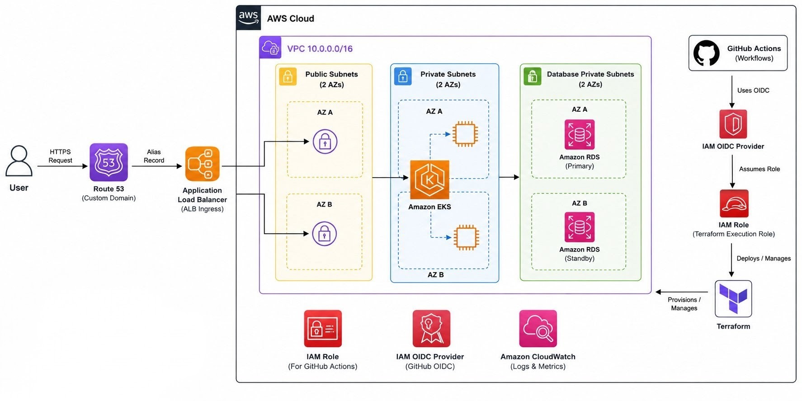

## Smart Palika 
A comprehensive civic complaint management system deployed to AWS using GitHub Workflows with infrastructure created through  Terraform.

## AWS architecture


## Project structure
```
├── README.md
├─.github/workflows.    # CI/CD
│   ├── publish_docker_hub.yaml
│   ├── tf_apply.yaml
│   └── tf_destroy.yaml
├── app                 # app source code
│   ├── README.md
│   ├── client
│   │   ├── Dockerfile
│   │   ├── README.md
│   │   ├── .gitignore
│   └── server
│   │   ├── Dockerfile
│   │   ├── README.md
│   │   ├── .gitignore
├── k8s                  # k8s manifest files
│   ├── README.md 
│   ├── <yaml files>
└── terraform            # terraform codes
    ├── README.md
    ├── backend
    │   └── dev.tfbackend
    ├── environments
    │   └── dev
    └── modules
        ├── eks
        ├── eks-addons
        ├── elasticache
        ├── rds
        ├── route53
        └── vpc
```

| Directory | Purpose |
|---|---|
| `.github/workflows` | Contains GitHub Actions workflows for CI/CD, Docker publishing, and Terraform operations. |
| `app` | Contains the application source code, including the frontend (`client`) and backend (`server`). |
| `app/client` | Contains the frontend application code and its Docker configuration. |
| `app/server` | Contains the backend application code and its Docker configuration. |
| `k8s` | Contains Kubernetes manifest files for deploying and managing the application on Kubernetes. |
| `terraform` | Contains Terraform infrastructure-as-code for provisioning and managing AWS resources. |
| `terraform/backend` | Contains Terraform backend configuration for storing Terraform state. |
| `terraform/environments` | Contains environment-specific Terraform configurations, such as `dev`. |
| `terraform/modules` | Contains reusable Terraform modules for AWS infrastructure components such as VPC, EKS, RDS, ElastiCache, Route 53, and EKS add-ons. |


## Documentation Links
Detailed information about each section can be found in its respective README.md file: 
- **GitHub Workflows Documentation:** [/app/README.md](/app/README.md)
- **App Documentation:** [/app/README.md](/app/README.md)
- **Kubernetes Documentation:** [/k8s/README.md](/k8s/README.md)
- **Terraform Documentation:** [/terraform/README.md](/terraform/README.md)